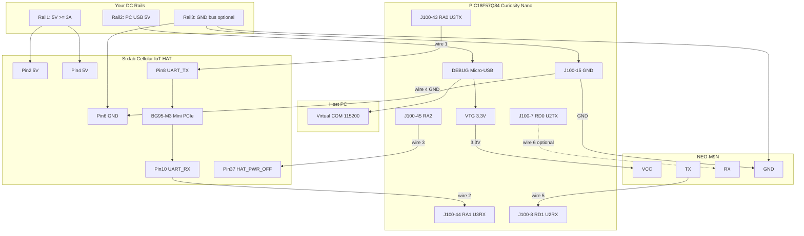

# Curiosity Nano + Sixfab Cellular IoT HAT + NEO-M9N — Bench Wiring

Wiring to test the PIC18F57Q84 Curiosity Nano with the Sixfab Cellular IoT HAT
(BG95-M3) and the u-blox NEO-M9N GNSS. This records the legacy bench harness;
it no longer matches the custom-board cellular pin map in `uart3.c` and
`bg95.c`.

> **This is the bench rig, not the product.** Everything below relies on the
> Curiosity Nano's on-board ATSAMD21 debugger, which does two jobs over one
> micro-USB cable: it programs the PIC, and it presents the 115200 `printf`
> console as a virtual COM port. **The custom board has no such chip.** It splits
> the two jobs across two connectors — `J_icsp`, a 6-pin ICSP header driven by a
> **PICkit 5** for programming *and* in-circuit debug, and `J_dbg`, a **USB-C**
> port behind a CP2102N bridge that provides the console alone. See
> [mcu-support-circuit.md](mcu-support-circuit.md) §5 and §9. Two habits from
> this page do not carry over: the PICkit must **not** be asked to power the
> target, and USB no longer powers anything at all.
>
> **Do not run the current custom-board firmware on this harness unchanged.**
> The harness uses RF4/RF5 and RA2 with the Sixfab HAT's active-HIGH
> `HAT_PWR_OFF`; the product firmware uses RA1/RA0 and active-HIGH
> `CELL_PWR_EN` on RE0.

## What you are testing

| Interface | Pins | Baud | Purpose |
|-----------|------|------|---------|
| UART3 | RF4 / RF5 (BG95; moved off RA0/RA1 — RA0 pin dead) | 115200 | BG95 AT commands / UDP |
| UART2 | RD0 / RD1 (J100-7 / J100-8) | 38400 → 115200 | NEO-M9N NMEA ingest (boots at 38400, firmware negotiates to 115200 for 25 Hz) |
| UART1 | On-board USB debugger | 115200 | `printf` debug terminal (no extra wires) |

---

## Wiring diagram

### Block diagram



### ASCII bench layout

```
  Rail 1 (5V, >=3A)                         Rail 2 (PC USB 5V)
        |                                           |
        +-------+                                   |
        |       |                                   |
     [Pin2]  [Pin4]   <-- both are 5V         [DEBUG USB]-----> PC (115200 COM)
      5V      5V                                    |
        |       |                                   |  on-board regulator
   +----+-------+-----------------------------------+----+
   |         Sixfab Cellular IoT HAT                 |    |
   |    +----------------------------------+         |    |
   |    |         BG95-M3 (Mini PCIe)      |         |    |
   |    |   UART via SJ7+SJ8 (soldered!)   |         |    |
   |    |   LTE antenna required           |         |    |
   |    +----------------------------------+         |    |
   |                                                 |    |
   |  [Pin6 GND]  [Pin8]  [Pin10]            [Pin37] |    |
   |     GND     UART_TX UART_RX         HAT_PWR_OFF |    |
   +------|----------|---------|----------------|----+
          |          |         |                |
   Rail1 GND   wire1 |   wire2 |          wire3 |
          |          |         |                |
          |    [J100-43] [J100-44]        [J100-45]
          |     RA0 TX    RA1 RX             RA2
          |          |         |                |
   +------|----------|---------|----------------|----+
   |      |   PIC18F57Q84 Curiosity Nano         |    |
   |      |                                      |    |
   |  [J100-15 GND]   [VTG 3.3V]                 |    |
   |      ^               |                      |    |
   |      |               |                      |    |
   |  [J100-8 RD1 RX] [J100-7 RD0 TX]            |    |
   |      ^               |                      |    |
   |      |         wire6 | (optional: config)   |    |
   |      |               v                      |    |
   |      |          [NEO-M9N RX]                |    |
   | wire5|                                      |    |
   |      v                                      |    |
   |  [NEO-M9N TX]   [NEO-M9N VCC] <--- VTG 3.3V |    |
   |  [NEO-M9N GND] <---+--- common GND ---------+    |
   |                                                 |    |
   |  (printf goes out USB CDC; no extra wire)       |    |
   +-------------------------------------------------+

Power note:
  HAT Pin 2 and 4 = 5 V.  HAT Pin 6 = GND (not 5 V).
  NEO-M9N VCC from Curiosity VTG (3.3 V), not from the HAT 5 V rail.
  Tie Rail 1 return, HAT pin 6, Curiosity GND, and NEO-M9N GND together.
```

### Pin map

```
Curiosity J100          Sixfab 40-pin header
-----------             --------------------
RF4      TX       ----> Pin 8   UART_TX  (to module RX)   [was RA0; RA0 dead]
RF5      RX       <---- Pin 10  UART_RX  (from module TX) [was RA1]
J100-45  RA2       ----> Pin 37  HAT_PWR_OFF (HIGH = off; cut SJ1 + 10k pull-up to VTG)
J100-15  GND       ----> Pin 6   GND
                         Pin 2,4  5V  <--- Rail 1

Curiosity J100          SparkFun NEO-M9N breakout
-----------             --------------------------
J100-8   RD1  RX  <---- TX     (GPS transmits NMEA; required)
J100-7   RD0  TX  ----> RX     (config to GPS; optional for basic RX)
VTG      3.3V     ----> 3V3    (or use breakout 5V pin — see power notes)
GND               ----> GND
```

---

## Hardware prep

### Sixfab HAT

Per [Sixfab Base HAT technical details](https://docs.sixfab.com/docs/raspberry-pi-3g-4g-lte-base-hat-technical-details):

1. **Solder jumpers SJ7 and SJ8** — UART is disconnected by default on the HAT.
2. **Cut solder jumper SJ1** — removes the HAT's internal pull-down on pin 37
   (HAT_PWR_OFF / GPIO26) so the external RA2 pull-up defines the default-off
   state for boot-order control (see the pull-up circuit under BG95 signal wires).
3. Seat the **BG95-M3** in the Mini PCIe slot.
4. Install an **LTE / main RF antenna** on the HAT (required for cellular).
5. Insert a valid **nano-SIM** (1.8 V class).
6. BG95 GNSS antenna is **not** required for farseer (position comes from the NEO-M9N).

### NEO-M9N (SparkFun breakout, e.g. GPS-15712)

[SparkFun NEO-M9N hookup guide](https://learn.sparkfun.com/tutorials/sparkfun-gps-neo-m9n-hookup-guide/hardware-overview):

1. Attach a **GNSS antenna** (U.FL / SMA / chip antenna depending on board variant).
2. Power options (pick **one**):
   - **`3V3`** ← Curiosity **VTG** (cleanest; matches PIC I/O), or
   - **`5V`** ← a 5 V source (on-board regulator steps down to 3.3 V; do not exceed 6 V), or
   - USB-C on the breakout (standalone power; still share GND with Curiosity for UART)
3. **UART I/O is 3.3 V** even if you feed the `5V` pin — do not put 5 V on TX/RX.
4. Leave the underside **`SPI` jumper open** (default) so UART stays enabled on the TX/RX pins.
5. No level shifting needed with Curiosity @ 3.3 V VTG.

---

## Power rails

| Rail | Use | Notes |
|------|-----|-------|
| **Rail 1 — 5 V, ≥ 3 A** | Sixfab HAT pins **2** and **4** | HAT rated 5 V / 3.0 A; BG95 can peak ~2.7 A during TX |
| **Rail 2 — USB 5 V** | Curiosity **DEBUG Micro-USB** | Powers board at 3.3 V VTG; provides virtual COM; also feeds NEO-M9N via VTG |
| **Rail 3 — spare** | Common ground bus (optional) | Tie HAT, Curiosity, and NEO-M9N GND together |

**Rules**

- Do **not** power the Sixfab HAT from Curiosity VTG (3.3 V).
- SparkFun GPS: power via breakout **`3V3`←Curiosity VTG** or breakout **`5V`←5 V** (regulated on-board). Don’t feed VTG into the SparkFun `5V` pin.
- **Do** share GND between Curiosity, HAT, and SparkFun GPS.
- Keep Curiosity VTG at **3.3 V** (factory default) — UART levels follow VTG.
- For external 3.3 V on Curiosity (instead of USB): apply 3.3 V to **VTG (J100-51)** and short **VOFF (J100-55) → GND** first (DS50003011 §3.3.2).

### Power sequencing (avoid back-power) — IMPORTANT

Bring **all rails up together** (or the PIC/VTG first). The PIC's VTG rail must
**never be dead while the HAT or GPS is powered and driving signals into it.**

Why: every PIC I/O pin has an ESD clamp diode to VDD. If a powered peripheral
drives a pin (UART TX idling HIGH, HAT_PWR_OFF bias, etc.) while VTG = 0, current
is injected through that diode into the dead VDD rail, dragging it to an invalid
~2 V. The Curiosity's on-board debugger monitors VTG within ±100 mV of its
setting; an out-of-window rail trips its power-fault protection — the **PS LED
blinks rapidly (~5 Hz)** and the target regulator is held off, so the **PIC never
boots** (DS50003011 §3.3, Table 3-1). Symptom seen on this bench: powering the
HAT before the Curiosity → PS LED rapid-blink, PIC dead. Fix: shared/simultaneous
rails so there is no "peripheral on / PIC off" window.

Mitigations if rails can ever skew: series resistors on every cross-board line
(RA2↔pin37, RF4↔pin8, RF5↔pin10) to limit ESD-diode current, or power the PIC
target from the **same 5 V rail** as the HAT via a 5 V→3.3 V regulator into VTG
(with VOFF→GND) so VTG is alive whenever the HAT is.

### NEO-M9N sequencing

The NEO-M9N is powered from **VTG (the PIC's own rail)**, so it inherently comes
up with the PIC — no back-power path and no pin-37-style control needed. Only if
you power it from a **separate always-on 5 V** does its `TXD → RD1` line become a
back-power injector (same failure mode as above); avoid that by keeping it on VTG.
For explicit PIC control, drive **RESET_N** (active-low, internal 7–13 kΩ pull-up,
NEO-M9N-00B UBX-19014285) rather than cutting VCC.

---

## Signal wires

### BG95 (UART3)

| Wire | Curiosity J100 | Sixfab HAT | Notes |
|------|----------------|------------|-------|
| 1 | RF4 | Pin 8 (UART_TX) | PIC TX → module RX; **~220 Ω series** (moved off RA0; RA0 dead) |
| 2 | RF5 | Pin 10 (UART_RX) | PIC RX ← module TX; **~220 Ω series** (moved off RA1) |
| 3 | J100-45 (RA2) | Pin 37 (HAT_PWR_OFF) | **Cut HAT SJ1**; add **10k pull-up RA2->VTG**. HIGH = module off; PIC drives LOW when ready so the BG95 boots after the PIC |
| 4 | J100-15 (GND) | Pin 6 (GND) | Required |
| (opt) | J100-52 (GND) | Pin 9 or 14 | Extra ground for noise |

#### Series resistors on UART (recommended)

Put **~100–330 Ω** (typ. **220 Ω**) in series on each BG95 UART wire (RA0↔pin 8 and RA1↔pin 10):

```
  Curiosity RA0 (TX) ----[220 Ω]---- HAT pin 8
  Curiosity RA1 (RX) ----[220 Ω]---- HAT pin 10
```

Why: if one board is powered and the other is not, the resistor limits current through ESD diodes (back-power protection). Fine at 115200 for short bench leads. Optional but cheap insurance.

Also fine: power Curiosity and HAT from the same switch so both rails rise/fall together.

#### Power-off / boot-order pull-up (HAT_PWR_OFF, pin 37)

Pin 37 (HAT_PWR_OFF, GPIO26) is **active-HIGH**: HIGH cuts the HAT power regulator
(module off), LOW powers it on. To make the BG95 boot **after** the PIC, cut the
HAT's internal pull-down (**SJ1**) and add a **10 kΩ pull-up from RA2 to VTG (3.3 V)**.
The pull-up holds pin 37 HIGH (module off) while the PIC is in reset / RA2 is
high-Z; firmware then drives RA2 LOW after `BG95_PWR_HOLD_MS` to power it on.

```
        VTG (3.3 V)
          |
        [ 10 kΩ ]        (pull-up; do NOT use 5 V — pin 37 is 3.3 V logic)
          |
   RA2 ---+---------------- HAT pin 37 (HAT_PWR_OFF, SJ1 CUT)
 (J100-45)
   RA2 high-Z / HIGH -> pin 37 HIGH -> module OFF
   RA2 driven LOW    -> pin 37 LOW  -> module ON
```

Note: pin 37 is 3.3 V logic (Raspberry Pi GPIO levels), so pull up to VTG, not 5 V.

### NEO-M9N SparkFun breakout (UART2)

| Wire | Curiosity J100 | SparkFun label | Notes |
|------|----------------|----------------|-------|
| 5 | J100-8 (RD1 RX) | **TX** | Required — GPS → PIC (NMEA) |
| 6 (opt) | J100-7 (RD0 TX) | **RX** | Only to send config to the GPS |
| — | VTG (3.3 V) | **3V3** | Preferred power from Curiosity |
| — *(alt)* | 5 V (USB VBUS / bench) | **5V** | OK — breakout regulates to 3.3 V; UART still 3.3 V |
| — | GND | **GND** | Same common ground |

Do **not** wire Curiosity VTG into the SparkFun **5V** pin (wrong direction / double-regulation mess). Use either `3V3←VTG` **or** `5V←5V supply`, not both.

Firmware only needs breakout **TX → PIC RD1** for NMEA ingest (`uart2.c` / `gps.c`).

---

## Bring-up

1. Power HAT (5 V rail) and Curiosity (USB) **together** with GND shared — do NOT power the HAT first while the PIC is unpowered (back-power fault; see "Power sequencing" above).
2. Build and flash via MPLAB (**Make and Program Device**).
3. Open the virtual COM port at **115200 8N1**.
4. Expect:
   - `Farseer boot: NEO-M9N + BG95 UDP (non-blocking)`
   - `[BG95] bring-up started; loop is non-blocking`
   - AT-driven status messages from `bg95.c`
   - GPS fix / NMEA-derived output from `gps.c` once the NEO-M9N has sky view

---

## Pre-power checklist

- [ ] All rails brought up together / PIC (VTG) not left dead while HAT or GPS is powered (avoids back-power fault; PS LED rapid-blink = fault)
- [ ] SJ7 + SJ8 soldered on Sixfab HAT
- [ ] SJ1 cut on Sixfab HAT (HAT_PWR_OFF pull-down removed for boot-order control)
- [ ] BG95 seated, **LTE antenna** attached, SIM installed
- [ ] 5 V ≥ 3 A on HAT pins 2/4; GND on HAT pin 6
- [ ] Curiosity powered via USB; VTG = **3.3 V**
- [ ] Shared GND: HAT + Curiosity + NEO-M9N
- [ ] BG95 UART: RF4→pin8, RF5→pin10; RA2→pin37 with 10k pull-up to VTG (boots after PIC)
- [ ] ~220 Ω series on each BG95 UART line (recommended)
- [ ] GPS: SparkFun TX→RD1 (J100-8), 3V3←VTG (or 5V←5V), GND common
- [ ] GPS antenna on SparkFun breakout; SPI jumper left open
- [ ] HAT level-shifts BG95 UART — do not bypass with raw 1.8 V module pins
- [ ] Do not drive HAT UART or NEO-M9N at 5 V logic

---

## References

- Curiosity pin labels: `pic_resources/.../02-01204-R6_TPR.csv`
- Curiosity power: `pic_resources/PIC18F57Q84-Curiosity-Nano-Hardware-User-Guide-DS50003011.pdf` §3.3
- NEO-M9N: `datasheets/NEO-M9N-00B_DataSheet_UBX-19014285.pdf` §4.2 / Table 11–12
- Firmware: `uart2.h`, `uart3.h`, `bg95.c`, `gps.c`, `main.c`
- Sixfab HAT: [technical details](https://docs.sixfab.com/docs/raspberry-pi-3g-4g-lte-base-hat-technical-details)
