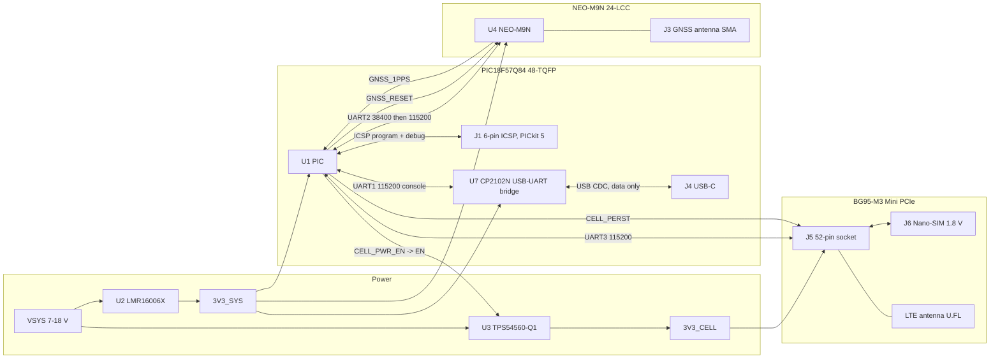
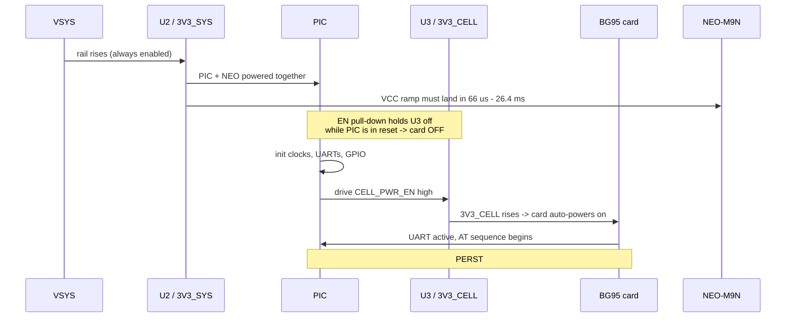

# Interconnect and PIC pin budget

The single place where the subsystems are reconciled against one another. The
circuit itself lives in the KiCad project
(`ki_cad_project/farseer/farseer.kicad_pro`); the net names below are the
global labels used on its sheets, so a net can be traced from sheet to sheet
by name. Per-block rationale lives in
[mcu-support-circuit.md](mcu-support-circuit.md),
[cellular-support-circuit.md](cellular-support-circuit.md),
[gnss-support-circuit.md](gnss-support-circuit.md), and
[power-support-circuit.md](power-support-circuit.md).

> **Every PPS assignment below was checked against the 48-pin column of Table
> 21-1 (PPS Input Selection) and Table 21-2 (PPS Output Selection)**,
> DS40002213F pp. 360-362. The PPS registers accept an illegal port silently
> and route nothing, so this check is the difference between a working board
> and a dead signal with no error.

---

## 1. System block diagram

Two rails, deliberately separate: `3V3_CELL` absorbs the BG95's 2.7 A bursts,
`3V3_SYS` stays quiet for the PIC and the GNSS receiver. **Both are 3.3 V and
must stay 3.3 V** — see
[cellular-support-circuit.md](cellular-support-circuit.md) §3 for why raising
either one breaks cross-rail logic levels.

**No level shifters exist anywhere on this board.** The Mini PCIe card
presents a 3.3 V UART and 3.3 V control pins, and the NEO-M9N runs from the
same 3.3 V rail as the PIC. The 1.8 V domains (card SIM, PCM, I2C) never
touch the MCU — the SIM lines run from the socket to the holder and nowhere
else. The Curiosity Nano's 74LVC1T45 shifters exist only because its target
voltage is adjustable.

---

## 2. Complete PIC pin budget

Existing assignments come from the firmware; new ones are allocated here.
Connections and series parts are in KiCad — this table is the allocation and
its PPS legality.

| Pin | Port | Net | Dir | Peripheral | PPS check (48-pin) | Source |
|-----|------|-----|-----|------------|--------------------|--------|
| 6 | VSS | GND | — | — | — | Req |
| 7 | VDD | `3V3_SYS` | — | — | — | Req |
| 9 | RB1 | *(reserved for W_DISABLE#)* | out | GPIO | none needed | not wired in KiCad |
| 16 | RB4 | `CELL_PERST` | out | GPIO | none needed | **new** |
| 17 | RB5 | `CELL_RI` | in | **INT2** | INT2PPS = **B**, F | **new**, Opt |
| 18 | RB6 | `ICSPCLK` | — | ICSP | — | Req, keep clear |
| 19 | RB7 | `ICSPDAT` | — | ICSP | — | Req, keep clear |
| 20 | RE3 | `MCLR` | in | reset | — | Req |
| 21 | RA0 | `CELL_TX` (from card pin 13) | in | **U3RX** | U3RXPPS = **A**, F | [uart3.c](../uart3.c) |
| 22 | RA1 | `CELL_RX` (to card pin 11) | out | **U3TX** | UART3 TX 0x26 = **A**, F | [uart3.c](../uart3.c) |
| 23 | RA2 | `CELL_CTS` (from card pin 25) | in | **U3CTS** | U3CTSPPS = **A**, F | **new**, Opt |
| 24 | RA3 | `CELL_RTS` (to card pin 23) | out | **U3RTS** | UART3 RTS 0x28 = **A**, F | **new**, Opt |
| 27 | RE0 | `CELL_PWR_EN` → `U3` EN | out | GPIO | none needed | [bg95.c](../bg95.c), **repurposed** |
| 30 | VDD | `3V3_SYS` | — | — | — | Req |
| 31 | VSS | GND | — | — | — | Req |
| 36 | RF0 | `USB_RXD` (to U7 RXD) | out | **U1TX** | UART1 TX 0x20 = C, **F** | [uart1.c](../uart1.c) |
| 37 | RF1 | `USB_TXD` (from U7 TXD) | in | **U1RX** | U1RXPPS = C, **F** | [uart1.c](../uart1.c) |
| 40 | RC2 | `GNSS_1PPS` | in | **CCP1** capture | CCP1PPS = **C**, F | **new** |
| 42 | RD0 | `GNSS_RX` (to NEO pin 21) | out | **U2TX** | UART2 TX 0x23 = B, **D** | [uart2.c](../uart2.c) |
| 43 | RD1 | `GNSS_TX` (from NEO pin 20) | in | **U2RX** | U2RXPPS = B, **D** | [uart2.c](../uart2.c) |
| 44 | RD2 | `GNSS_RESET` | out | GPIO | none needed | **new** |

The `USB_TXD`/`USB_RXD` names are **bridge-relative** (U7's TXD drives the
PIC's RX), same convention as `CELL_TX`/`CELL_RX` being card-relative — the
crossing is already in the names, do not cross again in layout.

Free after allocation: RC7 (1), RD4-RD7 (2-5), RB0 (8), RB2 (10), RB3 (11),
RF4-RF7 (12-15), RA4-RA5 (25-26), RE1-RE2 (28-29), RA7 (32), RA6 (33),
RC0 (34), RC1 (35), RF2 (38), RF3 (39), RC3 (41), RD3 (45), RC4-RC6 (46-48).
Roughly 27 spare pins — comfortable headroom for sensors, CAN, or an SD card
later.

Per DS40002213F §4.6, drive every unused pin low in firmware or tie it to VSS
through 1-10 kΩ.

### Why these particular pins

**The four UART3 signals use contiguous RA0-RA3 pins.** UART3 RX/CTS inputs and
TX/RTS outputs support **ports A and F** on the 48-pin part, so all four PORTA
assignments are legal. The net names are card-relative: RA0 receives
`CELL_TX`, while RA1 transmits `CELL_RX`. Putting flow control on port B or D
— which would look fine on a 40-pin part — would route nothing.

**`GNSS_1PPS` on RC2 buys hardware timestamping.** CCP1 capture is available
only on **ports C and F** at 48 pins, and RC2 is CCP1's own POR default.
Capturing the 1 PPS edge in hardware rather than an ISR is the difference
between ~30 ns and tens of microseconds of jitter, which is what makes the
pulse worth routing at all. The same C/F restriction applies to SMT1
(`SMT1SIGPPS` = C, F) if a longer capture window is ever wanted — the
constraint already called out in the project rules.

**`CELL_RI` on RB5 uses INT2**, whose 48-pin ports are **B and F**. That lets
a downlink URC wake the firmware instead of being polled.

**`CELL_PWR_EN` uses RE0**, a GPIO that needs no PPS routing. Its active-HIGH
polarity is defined in [bg95.c](../bg95.c) — see section 3.

**Programming and debug are `J1` with a PICkit 5**, not the USB-C port. The
PIC18F57Q84 has no USB peripheral, and its JTAG module is boundary scan only
(DS40002213F §39), so ICSP carries both the programming and the in-circuit
debug traffic. The USB-C port (`U7` from `3V3_SYS`, so it can never
back-power the board) is the console half of what the Curiosity Nano's
debugger used to provide, and nothing more.

---

## 3. Power-up and boot order

There is **no PWRKEY** on the Mini PCIe card; it has an automatic power-on
circuit and boots whenever `3V3_CELL` is live. Sequencing is therefore done
by gating the `3V3_CELL` buck.

1. **`3V3_SYS` first, always.** `U2` is unconditionally enabled, so the PIC
   and the NEO-M9N come up together on the same rail. They can never drive
   each other while one is unpowered, which eliminates the back-power failure
   documented in [bench-wiring.md](bench-wiring.md).
2. **The card starts OFF.** The `EN` pull-down on `3v3_cell.kicad_sch` holds
   `U3` disabled while the PIC is in reset and RE0 is high-impedance (the
   TPS54560-Q1's 1.2 µA internal pull-up only develops 0.12 V across it, well
   below the 1.2 V enable threshold).
3. **The PIC decides when the modem boots** by driving `CELL_PWR_EN` high.
4. **`PERST#` is for recovery, not boot** — a wedged modem gets a 2-3.8 s low
   pulse rather than a power cycle.

> **Firmware change done: `CELL_PWR_EN` polarity inverted.**
> [bg95.c](../bg95.c) previously drove RA2 for the Sixfab `HAT_PWR_OFF` pin,
> where **HIGH = module off**. On the custom board RE0 drives the buck's `EN`,
> where **HIGH = rail on**, and the firmware now matches: init writes
> `LATE0 = CELL_PWR_OFF` (0) and the power-on write in `ST_PWR_HOLD` is
> `LATE0 = CELL_PWR_ON` (1). The polarity is defined once by the
> `CELL_PWR_ON`/`CELL_PWR_OFF` macros in `bg95.c` — getting this backwards
> means the modem is powered before the PIC is ready, or never powers at all.

**GNSS ramp check.** The NEO-M9N tolerates a VCC ramp of only
**20-8000 µs/V**, so a 0 → 3.3 V rise must take between **66 µs and
26.4 ms**; too fast can permanently damage it. That constrains `U2`, and it
is verified in [power-support-circuit.md](power-support-circuit.md).

---

## 4. Combined pre-order checklist

Per-block checklists live in each document. These are the cross-cutting items
that no single document owns.

- [ ] Every PPS assignment re-verified against the **48-pin** column of
      Tables 21-1 and 21-2, not the 28/40-pin columns
- [ ] `CELL_CTS` / `CELL_RTS` on port A or F only (UART3 restriction)
- [ ] `GNSS_1PPS` on port C or F only (CCP1 / SMT1 restriction)
- [x] `CELL_PWR_EN` polarity flipped in [bg95.c](../bg95.c) — high now means
      on
- [ ] `U3` EN pull-down fitted so the card is off while the PIC is in reset
- [ ] `U2` ramp inside the NEO-M9N's 66 µs - 26.4 ms window
- [ ] `FB1` on the GNSS branch has DCR **< 0.2 Ω**
- [ ] Both rails still **3.3 V nominal**
- [ ] Single ground plane, with the `U3` switch node and the SIM/RF areas
      kept apart
- [ ] `U3` power stage routed away from both antenna connectors and cable
      runs
- [ ] Unused PIC pins driven low or pulled to VSS through 1-10 kΩ
- [ ] `U7` fed from `3V3_SYS`, never from USB VBUS — the console must not be
      able to power or back-power the board
- [ ] PICkit 5 target power left off; the board supplies its own rails while
      being programmed or debugged
- [ ] GNSS and LTE antennas separated as far as the enclosure allows (see
      [procurement.md](procurement.md))
